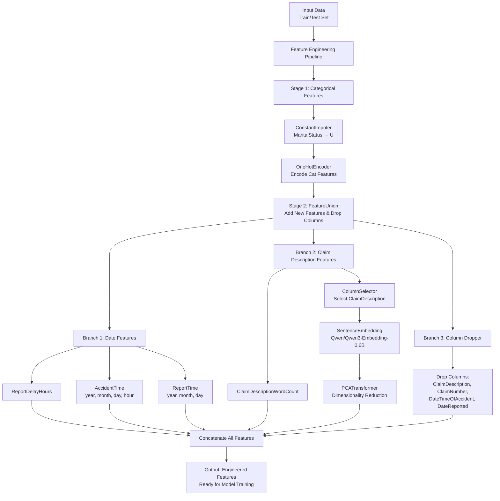

# Kaggle challenge: Actuarial loss prediction 

<br>

<center><a href="https://bchung0.github.io/actuarial-loss-prediction/?types=nodes,datasets&expandAllPipelines=false&pid=__default__" target="_blank" rel="noopener noreferrer">
  
</a></center>

## Goal

The goal of this challenge is to predict Workers Compensation claims using highly realistic synthetic data.

Data: 
* train.csv.: The training set containing 54,000 insurance policies that you can use to train your model
* test.csv: The test set.
* sample_submission.csv: A sample submission file in the correct format

Click here to access the kaggle challenge page: [https://www.kaggle.com/competitions/actuarial-loss-estimation/overview](https://www.kaggle.com/competitions/actuarial-loss-estimation/overview)

The evaluation metric is RSME. This metric works well with continous target variable. It penalizes big mistakes heavily, which is suitable for this problem as we want to avoid large errors on claim cost prediction. Here we tend to care more about extreme deviation than median behavior.
We have to be careful about outliers when using this metric.

## Project structure

```py
project-dir         # Parent directory of the template
├── .gitignore      # Hidden file that prevents staging of unnecessary files to git
├── conf            # Project configuration files
├── data            # Local project data (not committed to version control)
├── docs            # Project documentation
├── notebooks       # Project-related Jupyter notebooks (can be used for experimental code before moving the code to src)
├── pyproject.toml  # Identifies the project root and contains configuration information
├── README.md       # Project README
└── src             # Project source code
```

## Feature Engineering

### Pipeline Architecture

The feature engineering pipeline is structured in two main stages:



#### Data fields

* <b> ClaimNumber </b>: Unique policy identifier
* <b> DateTimeOfAccident</b>: Date and time of accident
* <b> DateReported</b>: Date that accident was reported
* <b> Age</b>: Age of worker
* <b> Gender</b>: Gender of worker
* <b> MaritalStatus</b>: Martial status of worker. (M)arried, (S)ingle, (U)nknown.
* <b> DependentChildren</b>: The number of dependent children
* <b> DependentsOther</b>: The number of dependants excluding children
* <b> WeeklyWages</b>: Total weekly wage
* <b> PartTimeFullTime</b>: Binary (P) or (F)
* <b> HoursWorkedPerWeek</b>: Total hours worked per week
* <b> DaysWorkedPerWeek</b>: Number of days worked per week
* <b> ClaimDescription</b>: Free text description of the claim
* <b> InitialIncurredClaimCost</b>: Initial estimate by the insurer of the claim cost
* <b> UltimateIncurredClaimCost</b>: Total claims payments by the insurance company. This is the field you are asked to predict in the test set.

<br>

The dataset contains relatively clean data. Simple checks are done to make sure we don't have irrelevant data (example: `DaysWorkedPerWeek` between 0 and 7, `DateReported` after `DateTimeOfAccident`, `HoursWorkedPerWeek`<150, etc.).

The target `UltimateIncurredClaimCost` is highly positively skewed, with a few very large values, and it contains strickly positive values. 

The only feature with misssing values is `MaritalStatus`, with 29 missing entries in training set (out of 54000 rows, ~0.05%) and 18 in test set.  Without extra information provided, I chose to impute them as "U" (Unknown). The number of missing observations is too low to reliably determine whether they correspond to the M or S category based on other features or the target-based patterns.

## Model Training

Tree-based ensemble models have good performance with structured data. They have the advantage to be robust to outliers and can handle varying ranges of features, that is why there is no need to do scaling. They can handle skewed feature like `InitialIncurredClaimCost`.

Here, I use a sckit-learn tree-based ensemble model `HistGradientBoostingRegressor`. I usually use lightGBM or XGBoost, but I had a kernel crash trouble within jupyther notebook in vscode, so I use this similar model.


