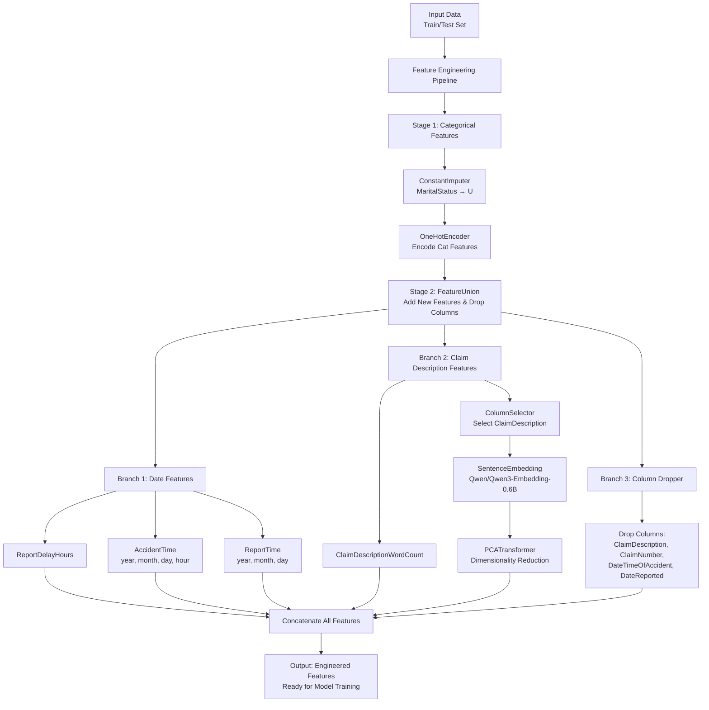

# Kaggle challenge: Actuarial loss prediction 

<p align="center">


</p>

<br>
<br>

<p align="center">
  <a href="https://bchung0.github.io/actuarial-loss-prediction/?types=nodes,datasets&expandAllPipelines=false&pid=__default__" target="_blank" rel="noopener noreferrer">
    
  </a>
</p>

<br>

## Goal

The goal of this challenge is to predict **Workers Compensation claim costs** using realistic synthetic data.

The target variable is:

- `UltimateIncurredClaimCost` (continuous, strictly positive)

The evaluation metric is **RMSE (Root Mean Squared Error)**, which heavily penalizes large errors. This makes the problem particularly sensitive to outliers. It is suitable for this problem as we want to avoid large errors on claim cost prediction.

The challenge is closed, but late submissions can still be made after the official deadline to evaluate model predictions.
<br>

## Data 
- train.csv.: 54,000 insurance policies for training
- test.csv: test set for prediction
- sample_submission.csv

The dataset was built and supplied by Colin Priest.

<br>
Click here to access the kaggle challenge page: 
[https://www.kaggle.com/competitions/actuarial-loss-estimation/overview](https://www.kaggle.com/competitions/actuarial-loss-estimation/overview)

<br>

## Project structure


```py
.
├── conf/                                      # configuration files
│   ├── base/
│   │   ├── catalog.yml
│   │   ├── parameters.yml
│   │   ├── parameters_feature_engineering.yml
│   │   ├── parameters_model_prediction.yml
│   │   └── parameters_model_training.yml
├── data/                                      # dataset storage
├── notebooks/                                 # exploratory notebooks
├── src/                                       # source code
│   ├── actuarial_loss_prediction/
│   │   ├── __init__.py
│   │   ├── __main__.py
│   │   ├── settings.py
│   │   ├── pipeline_registry.py
│   │   └── pipelines/
│   │       ├── __init__.py
│   │       ├── feature_engineering/
│   │       │   ├── __init__.py
│   │       │   ├── nodes.py
│   │       │   ├── pipeline.py
│   │       │   └── transformers.py
│   │       ├── model_training/
│   │       │   ├── __init__.py
│   │       │   ├── nodes.py
│   │       │   └── pipeline.py
│   │       └── model_prediction/
│   │           ├── __init__.py
│   │           ├── nodes.py
│   │           └── pipeline.py
└── tests/                                      # automated tests
```
<br>

## Pipeline Architecture

<br>



<br>

## Feature Engineering

#### Data fields:

* <b> ClaimNumber </b>: Unique policy identifier
* <b> DateTimeOfAccident</b>: Date and time of accident
* <b> DateReported</b>: Date that accident was reported
* <b> Age</b>: Age of worker
* <b> Gender</b>: Gender of worker
* <b> MaritalStatus</b>: Martial status of worker. (M)arried, (S)ingle, (U)nknown.
* <b> DependentChildren</b>: The number of dependent children
* <b> DependentsOther</b>: The number of dependants excluding children
* <b> WeeklyWages</b>: Total weekly wage
* <b> PartTimeFullTime</b>: Binary (P) or (F)
* <b> HoursWorkedPerWeek</b>: Total hours worked per week
* <b> DaysWorkedPerWeek</b>: Number of days worked per week
* <b> ClaimDescription</b>: Free text description of the claim
* <b> InitialIncurredClaimCost</b>: Initial estimate by the insurer of the claim cost
* <b> UltimateIncurredClaimCost</b>: Total claims payments by the insurance company. This is the field you are asked to predict in the test set.

<br>

The dataset is relatively clean. Basic validation checks were done to make sure there is no irrelevant data (example: `DaysWorkedPerWeek` between 0 and 7, `DateReported` after `DateTimeOfAccident`, `HoursWorkedPerWeek`<150, etc.). These checks should be performed during the exploratory phase, and they can also be incorporated into the pipeline at a later stage.

<br>

The only feature containing missing values is `MaritalStatus`, with 29 missing entries in the training set (out of 54000 rows, ~0.05%) and 18 in the test set.  Given the very low proportion of missing and the absence of additional contextual information, these values were imputed as "U" (Unknown). The number of missing observations is too low to reliably infer whether they correspond to the M or S categories based on other features or the target-based patterns.

<br>

### Datetime features
Time-based features were extracted from `DateTimeOfAccident` and `DateReported`, including:
- Year, month, and day components
- `report_delay_hours`, capturing the delay between accident occurrence and reporting time.

<br>
The challenge description specifies that competitors are encouraged to account for claims inflation. However, since the train/test split on `DateTimeOfAccident` and `DateReported` preserves a similar temporal distribution rather than using a chronological past/future split, inflation effects are implicitly captured by the time-based features already present in the dataset.

<br>

### Text feature

The `ClaimDescription` field contains free-text descriptions of accident claims. To leverage this information, embeddings were generated using the `Qwen/Qwen3-Embedding-0.6B` sentence transformer model. These embeddings were then reduced to 100 dimensions using PCA to improve efficiency and reduce noise.

<br>

### Future Improvements

Further work on `ClaimDescription` could improve the model performance: 
- Experiment with stronger embedding models or LLM-based encoders
- Extract structured information (using LLM) such as:
    - Affected body parts
    - Injury types
    - Accident categories or causes

<br>

## Target Distribution

The target variable, `UltimateIncurredClaimCost`, is strictly positive and heavily right-skewed, with a small number of extremely large values.

To improve model performance, two common strategies may be considered:
- Applying a log transformation to the target variable
- Removing extreme outliers using a configurable threshold (e.g., setting `multiplier` in `parameters_feature_engineering.yml` to 3.0 for conservative filtering, or higher values for less aggressive filtering to remove only extreme cases)

These approaches can help stabilize variance and reduce the influence of extreme values on the loss function, particularly if they are not generalisable. A conservative approach is recommended, as the model should still be able to capture large claim costs. At this stage, a log-transformation of the target has not been implemented in the pipeline.

<br>

## Model Training

Tree-based ensemble methods perform particularly well on structured tabular data. They are robust to outliers, handle non-linear relationships effectively, and naturally support features with varying scales, eliminating the need for feature scaling. They also handle skewed features such as `InitialIncurredClaimCost` without requiring transformation (scaling).

For this project, I use scikit-learn’s `HistGradientBoostingRegressor`, a gradient boosting model based on decision trees.

LightGBM and XGBoost were also considered; Note: I usually use them, but they were not used in this project due to local environment instability. I had repeated kernel crashes when running them in Jupyter notebooks in VS Code on macOS.


<br>

## Predictions

The pipeline outputs a versioned `predictions.csv` file in the same format as the sample submission. It contains two columns: `ClaimNumber` and the predicted `UltimateIncurredClaimCost`.


